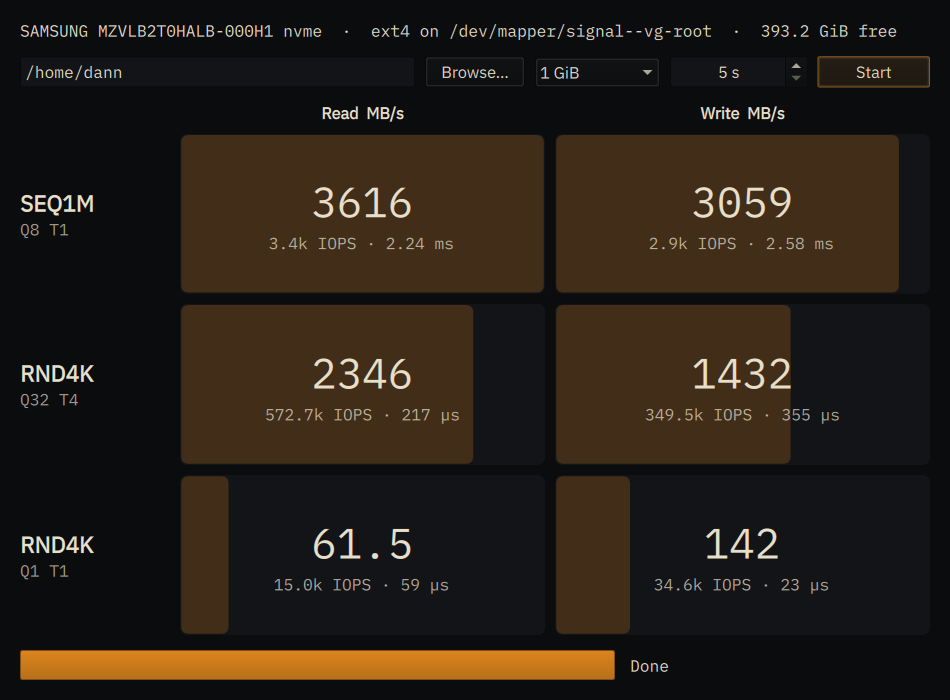
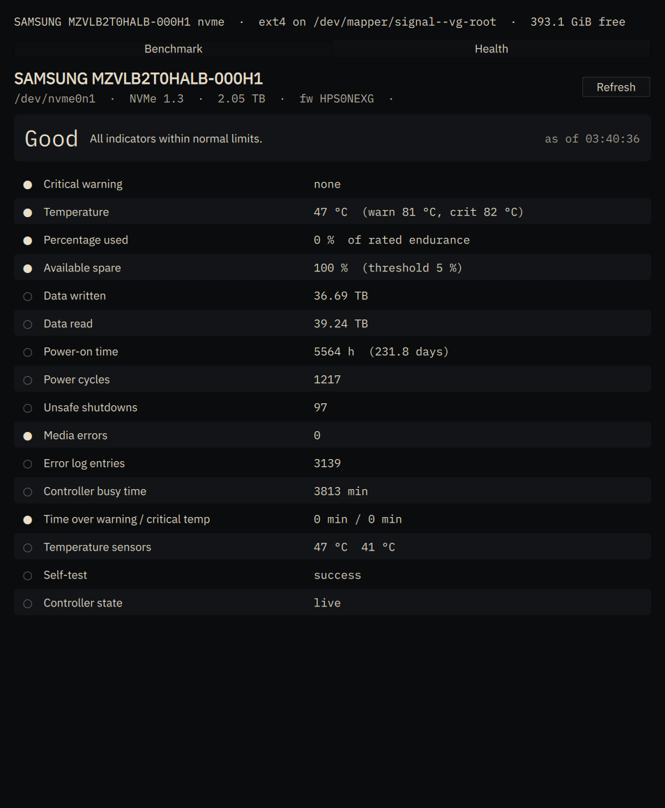

# fiomark

A CrystalDiskMark-style storage benchmark for Linux: a small Qt 6 / QML front end over
[`fio`](https://fio.readthedocs.io/), with a terminal mode for machines without a display.





fio is the standard tool for measuring storage, but its output is long and its options are easy
to get subtly wrong (forget `--direct=1` and you benchmark your RAM). fiomark runs one fixed,
well-understood suite with safe defaults and shows the six numbers that matter.

## Features

- **Six results at a glance**: three tests, each read and write, as MB/s with IOPS and mean
  completion latency underneath, over bars scaled against the fastest result.
- **Correct by default**: direct I/O (page cache bypassed), `io_uring`, time-based runs, a test
  file laid out once and reused, and `fsync` on layout.
- **Knows what it is testing**: resolves the directory you pick through LVM, dm-crypt and
  partitions to the physical device and shows its model, the filesystem, and free space.
- **Guard rails**: refuses to start without enough free space or write permission, and warns when
  the target is ZFS (ARC and compression distort results) or tmpfs (that is RAM).
- **Cleans up**: the test file is removed when the run finishes, is stopped, fails, or the window
  is closed mid-run.
- **Follows your desktop**: uses Qt Quick Controls' Fusion style with the system palette, so it
  picks up light/dark themes (for example through `qt6ct`) and has no colours of its own.
- **Health tab**: drive identity (model, serial, firmware, size, bus) and the full SMART
  attribute set, for NVMe (critical warnings, temperature against the drive's own thresholds,
  percentage used, spare, data written/read, power-on time, cycles, unsafe shutdowns, media
  errors, error log, self-test) and ATA (self-assessment, temperature, bad sectors, the raw
  attribute table). Read through **udisks2 over D-Bus**, so it needs no root and no prompt.
  A Refresh button asks the drive for fresh data. Overall rating: Good, Caution or Bad.
- **Headless modes**: `--cli` runs the suite and prints a table; `--smart` prints the health
  report. No display needed for either.

## The suite

| Row | fio parameters | What it tells you |
|---|---|---|
| **SEQ1M Q8 T1** | 1 MiB blocks, sequential, queue depth 8, 1 job | Large file copies, video, disk images. The "headline" number; limited by the PCIe link on fast drives. |
| **RND4K Q32 T4** | 4 KiB blocks, random, queue depth 32, 4 jobs | Peak IOPS under heavy parallel load: databases, many VMs, build servers. |
| **RND4K Q1 T1** | 4 KiB blocks, random, queue depth 1, 1 job | How the machine *feels*: application launches, package installs, git. Dominated by latency, so it differs far less between drives than the rows above. |

Each row runs a read pass then a write pass for the configured number of seconds.

### Reading the results

- **MB/s** is decimal megabytes per second (10⁶ bytes), as drive vendors quote it.
- **IOPS** is operations per second; for 4 KiB tests `MB/s ≈ IOPS × 4096 / 10⁶`.
- **Latency** is fio's mean completion latency (`clat`). At queue depth 1 it is the time one
  request takes; at high queue depths it includes time spent queued and is mainly useful for
  comparing drives under the same settings.
- Bars use a square-root scale so the small Q1T1 figures remain visible next to sequential ones.

Reference points (SEQ1M read): SATA SSD ≈ 550 MB/s, PCIe 3.0 x4 NVMe ≈ 3,500 MB/s,
PCIe 4.0 x4 ≈ 7,000 MB/s, PCIe 5.0 x4 ≈ 12,000+ MB/s.

## Requirements

- Linux with a kernel that allows `io_uring` (5.1+; some hardened or containerised
  environments disable it, in which case fio fails to start a job and fiomark reports the error)
- `fio` 3.x on `PATH`
- udisks2 running (for the Health tab; the benchmark works without it)
- Qt 6.5 or newer: Core, Gui, DBus, Qml, Quick, QuickControls2, plus the QML modules for Controls,
  Layouts, Dialogs, Templates and Window
- CMake 3.21+, a C++20 compiler, and optionally Ninja
- `lsblk` (util-linux) for the device model line

Debian 13 / Ubuntu 24.04+:

```sh
sudo apt install fio cmake ninja-build g++ qt6-base-dev qt6-declarative-dev \
    qml6-module-qtquick qml6-module-qtquick-controls qml6-module-qtquick-layouts \
    qml6-module-qtquick-dialogs qml6-module-qtquick-templates qml6-module-qtquick-window \
    qml6-module-qtqml-workerscript qml6-module-qtcore
```

## Install from a release

Debian 13 (trixie), amd64:

```sh
curl -fsSLO https://github.com/0x64616e6e/fiomark/releases/download/v0.2.0/fiomark_0.2.0-1_amd64.deb
sudo apt install ./fiomark_0.2.0-1_amd64.deb
```

Newer versions, if any, are on the [releases page](https://github.com/0x64616e6e/fiomark/releases).

Each release lists SHA-256 checksums for its packages. The packages need Qt 6.8 or newer at
runtime; elsewhere, build from source.

## Build and install

```sh
cmake -S . -B build -G Ninja -DCMAKE_BUILD_TYPE=Release -DCMAKE_INSTALL_PREFIX=$HOME/.local
cmake --build build
cmake --install build      # ~/.local/bin/fiomark and a desktop entry
```

Use `-DCMAKE_INSTALL_PREFIX=/usr/local` with `sudo cmake --install build` for a system-wide
install. To run without installing: `./build/fiomark`.

### Debian package

The repository carries `debian/` packaging (debhelper 13, CMake + Ninja, hardening enabled).
Library dependencies are computed by `dh_shlibdeps`; `fio` and the QML runtime modules are
declared explicitly.

```sh
sudo apt install debhelper dpkg-dev fakeroot lintian       # once
dpkg-buildpackage -us -uc -b                                # writes ../fiomark_<version>_amd64.deb
lintian ../fiomark_*.changes
sudo apt install ../fiomark_*_amd64.deb                     # pulls in fio and the Qt runtime
```

The build runs two smoke tests (`ctest`): `--help` output, and refusal of a non-existent
directory. Neither needs a display or touches a disk. A `-dbgsym` package with debug symbols is
produced alongside. Remove with `sudo apt remove fiomark`.

## Usage

### Window

```sh
fiomark
```

Pick a directory on the filesystem you want to measure, choose the test file size and the seconds
per test, press **Start**. **Stop** aborts the current fio job and removes the test file.

Options can preset the controls, and `--start` begins immediately:

```sh
fiomark --dir /mnt/scratch --size 8 --runtime 30 --start
```

| Option | Meaning | Default |
|---|---|---|
| `--dir PATH` | directory to create the test file in | home directory |
| `--size GiB` | test file size | 4 |
| `--runtime S` | seconds per test (six tests per run) | 15 |
| `--start` | start the run as soon as the window opens | off |
| `--health` | open on the Health tab | off |

### Terminal

```sh
fiomark --cli [--dir PATH] [--size GiB] [--runtime S]
```

```
SAMSUNG MZVLB2T0HALB-000H1 nvme  ·  ext4 on /dev/mapper/vg-root  ·  393.2 GiB free
  Preparing test file
  SEQ1M Q8 T1 read
  ...
test             read MB/s  write MB/s   read IOPS  write IOPS
SEQ1M Q8 T1         3614.3      3056.0        3447        2914
RND4K Q32 T4        2340.0      1403.2      571291      342582
RND4K Q1 T1           58.2       126.5       14213       30885
```

Exit status is 0 on success and 1 if the run failed or could not start.

```sh
fiomark --smart [--dir PATH]
```

```
SAMSUNG MZVLB2T0HALB-000H1  S4J0NXXXXXXXXX  fw HPS0NEXG  2.05 TB  NVMe 1.3  [/dev/nvme0n1]
Health: Good  —  All indicators within normal limits.  (SMART data as of 03:38:57)

   Critical warning                    none
   Temperature                         50 °C  (warn 81 °C, crit 82 °C)
   Percentage used                     0 %  of rated endurance
   ...
```

## Getting meaningful numbers

- **Laptops: plug in.** Power-saving profiles throttle both the CPU and the drive.
- **Choose the size deliberately.** Small files (1 GiB) fit inside a drive's SLC cache and show
  its best case. 16–32 GiB gets closer to sustained behaviour on consumer drives.
- **Longer runs are steadier.** 5 s is fine for a sanity check; use 30 s or more to compare drives.
- **Leave the machine idle** during the run, and let a hot drive cool before repeating: NVMe
  drives throttle at 70–80 °C (`sudo nvme smart-log /dev/nvme0 | grep temperature`).
- **Copy-on-write and caching filesystems measure themselves.** On ZFS and btrfs, compression,
  checksumming and caches are part of the result. That is a valid thing to measure, just not the
  raw device. fiomark warns for ZFS.
- **Encrypted volumes** (LUKS) include the cost of encryption; on CPUs with AES-NI that is small
  for sequential I/O and more visible at high IOPS.

### Wear

Each run writes roughly the test file size once for layout plus whatever the three write passes
manage in their time slots: on a fast NVMe drive at the defaults, some tens of gigabytes. That is
negligible for a modern SSD's endurance rating, but there is no reason to run it in a loop.

## How it works

```
Main.qml ──(properties, start/stop)──► FioRunner (C++, QObject, QML_ELEMENT)
                                          │  one QProcess per test:
                                          │  fio --output-format=json --direct=1 --ioengine=io_uring …
                                          ▼
                                       JSON ──► QJsonDocument ──► results (QVariantList) ──► QML grid
```

- `smartinfo.{h,cpp}`: resolves the directory to its physical disk (`lsblk`), finds the drive
  object in udisks2 (`org.freedesktop.UDisks2.Block` → `Drive`), calls `SmartUpdate` and reads
  `org.freedesktop.UDisks2.NVMe.Controller` or `Drive.Ata`, and rates the result. udisks2 does
  the privileged part; polkit allows it for active local sessions by default.
- `fiorunner.{h,cpp}`: builds the job queue (one layout pass, then read/write per row), runs fio
  asynchronously through `QProcess`, parses `jobs[0].read|write.{bw_bytes, iops, clat_ns.mean}`
  from the JSON, and exposes `results`, `progress`, `currentTest`, `deviceInfo`, `warning`,
  `error` and `running` as properties. It depends only on Qt Core, which is what makes `--cli`
  possible without a GUI session.
- `Main.qml`: the window. No logic beyond formatting numbers and scaling bars.
- `main.cpp`: chooses between the `QCoreApplication` CLI path and the QML GUI, and selects the
  Fusion style so the system palette applies.
- Progress is time-based (each test has a known duration); the layout pass has no fixed duration
  and fills its slot gradually.

### Project layout

```
CMakeLists.txt      build, QML module (URI FioMark), install rules
main.cpp            entry point: GUI or --cli
fiorunner.h/.cpp    fio orchestration and JSON parsing
smartinfo.h/.cpp    SMART health via udisks2 (D-Bus)
Main.qml            user interface
fiomark.desktop     desktop entry
fiomark.1           man page
debian/             Debian packaging
docs/screenshot.png
```

## Compared with CrystalDiskMark

The rows mirror CrystalDiskMark's default profile (SEQ1M Q8T1, RND4K Q32T4 stands in for its
Q32T1/T16 variants, RND4K Q1T1), so results are broadly comparable, but the engines differ
(fio with `io_uring` on Linux versus DiskSpd on Windows), as do filesystems and drivers. Compare
fiomark with fiomark.

## Limitations and ideas

- The I/O engine is fixed to `io_uring`; there is no fallback to `libaio` yet.
- The suite is fixed; no custom profiles, mixed read/write, or sustained-write test.
- No history, export, or side-by-side comparison of runs.
- Drives behind USB bridges usually hide SMART from udisks2; there is no smartctl fallback yet.
- No SMART self-test start/abort yet (udisks2 offers it).
- Progress is estimated from time rather than read from fio's status output.
- Raw block devices are not supported on purpose: fiomark only ever writes a file it created.

## License

MIT. See [LICENSE](LICENSE).
